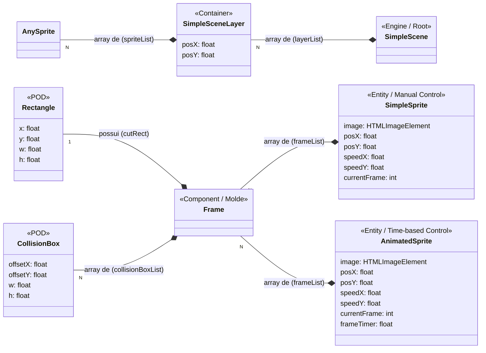

```mermaid
classDiagram
    direction RL

    class SimpleScene {
        <<Engine / Root>>
    }

    class SimpleSceneLayer {
        <<Container>>
        posX: float
        posY: float
    }

    class SimpleSprite {
        <<Entity / Manual Control>>
        image: HTMLImageElement
        posX: float
        posY: float
        speedX: float
        speedY: float
        currentFrame: int
    }

    class AnimatedSprite {
        <<Entity / Time-based Control>>
        image: HTMLImageElement
        posX: float
        posY: float
        speedX: float
        speedY: float
        currentFrame: int
        frameTimer: float
    }

    class Frame {
        <<Component / Molde>>
    }

    class Rectangle {
        <<POD>>
        x: float
        y: float
        w: float
        h: float
    }

    class CollisionBox {
        <<POD>>
        offsetX: float
        offsetY: float
        w: float
        h: float
    }

    SimpleScene *-- "N" SimpleSceneLayer : array de (layerList)
    SimpleSceneLayer *-- "N" AnySprite : array de (spriteList)

    SimpleSprite *-- "N" Frame : array de (frameList)
    AnimatedSprite *-- "N" Frame : array de (frameList)
    
    Frame *-- "1" Rectangle : possui (cutRect)
    Frame *-- "N" CollisionBox : array de (collisionBoxList)
```