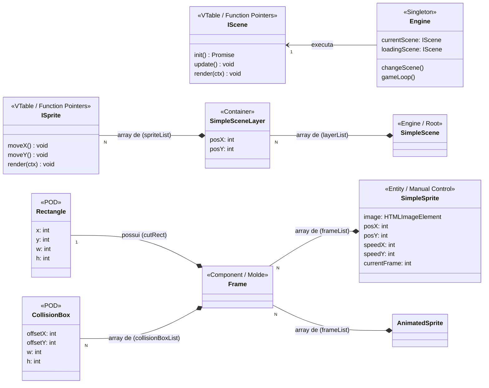

```mermaid
classDiagram
    direction RL

    class Engine {
        <<Singleton>>
        currentScene: IScene
        loadingScene: IScene
        changeScene()
        gameLoop()
    }

    class IScene {
        <<VTable / Function Pointers>>
        init() Promise
        update() void
        render(ctx) void
    }

    class ISprite {
        <<VTable / Function Pointers>>
        moveX() void
        moveY() void
        render(ctx) void
    }

    class SimpleScene {
        <<Engine / Root>>
    }

    class SimpleSceneLayer {
        <<Container>>
        posX: int
        posY: int
    }

    class SimpleSprite {
        <<Entity / Manual Control>>
        image: HTMLImageElement
        posX: int
        posY: int
        speedX: int
        speedY: int
        currentFrame: int
    }

    class Frame {
        <<Component / Molde>>
    }

    class Rectangle {
        <<POD>>
        x: int
        y: int
        w: int
        h: int
    }

    class CollisionBox {
        <<POD>>
        offsetX: int
        offsetY: int
        w: int
        h: int
    }

    Engine --> "1" IScene : executa
    SimpleScene *-- "N" SimpleSceneLayer : array de (layerList)
    SimpleSceneLayer *-- "N" ISprite : array de (spriteList)

    
    SimpleSprite *-- "N" Frame : array de (frameList)
    AnimatedSprite *-- "N" Frame : array de (frameList)
    
    Frame *-- "1" Rectangle : possui (cutRect)
    Frame *-- "N" CollisionBox : array de (collisionBoxList)
```