# O Hardware Sob a Lente do Programador
## Do código ao silício: memória, dados, paralelismo e performance

> **Ideia central do curso:** o computador não executa abstrações como `Sprite`, `classe` ou `array`. Ele transforma código em instruções que movimentam e transformam dados através de registradores, caches, memória e unidades de execução. Programar para performance é, em grande parte, organizar esse fluxo de dados de forma compatível com o hardware.

---

## A pergunta que atravessa todo o curso

> **Onde está o dado, quem precisa dele e quanto custa levá-lo até lá?**

A mesma pergunta será feita em diferentes níveis:

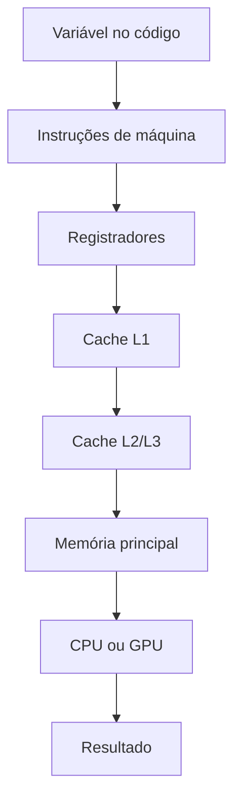

A proposta não é transformar o programador em projetista de chips. É desenvolver um modelo mental mais próximo do funcionamento físico da máquina.

---

# Aula 0 — O computador não executa abstrações

## Do código-fonte à máquina

Um programa escrito em C, C++, Rust ou Zig parece trabalhar diretamente com variáveis e objetos:

```c
int x = a + b;
```

Mas o processador não entende `a`, `b` ou `x` como o programador os imagina. O compilador transforma esse código em instruções de máquina que carregam dados, executam operações e armazenam resultados.

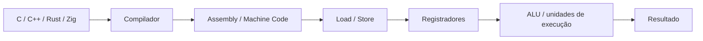

### Primeira abstração visual

```text
Código
  │
  ▼
"x = a + b"
  │
  ▼
Carregar dados
  │
  ▼
Registradores
  │
  ▼
Somar
  │
  ▼
Guardar resultado
```

### Conceitos-chave

- instruções de máquina;
- registradores;
- operações load/store;
- ALU e unidades de execução;
- compilação e otimização;
- diferença entre abstração da linguagem e realidade física.

### Mensagem da aula

> O compilador pode esconder a máquina do programador, mas a máquina continua existindo.

---

# Aula 1 — O Abismo da Memória
## CPU, caches e RAM

Uma CPU moderna executa instruções em uma escala de bilhões de ciclos por segundo. A memória principal é muito mais lenta do que o processador consegue executar operações. Por isso, o sistema cria uma hierarquia de memória.

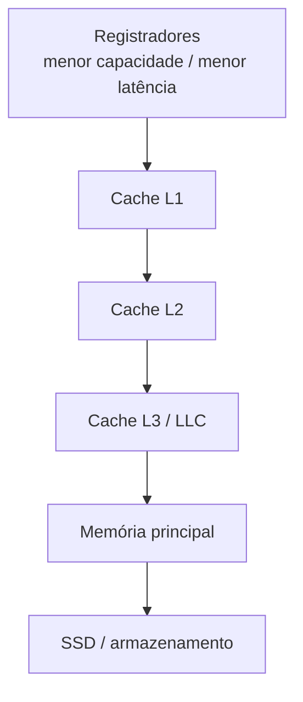

A melhor maneira de pensar nessa hierarquia não é decorar números fixos de ciclos, mas compreender a relação:

> **quanto mais distante do núcleo de execução, maior tende a ser a latência e maior tende a ser a capacidade.**

### A metáfora do escritório

```text
Registrador → algo na sua mão
L1          → objeto sobre a mesa
L2          → gaveta da mesa
L3          → armário da sala
RAM         → biblioteca do prédio
SSD         → arquivo externo
```

### O que acontece em um cache miss?

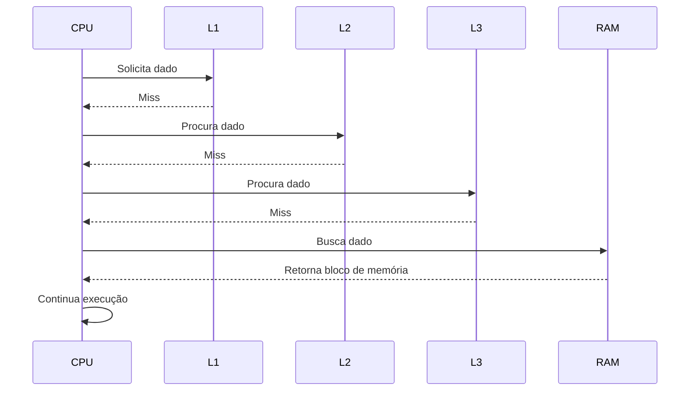

O custo de um acesso à RAM não deve ser pensado apenas como "alguns ciclos a mais". A questão é que, enquanto espera, o processador pode ficar limitado pela dependência daquele dado, embora processadores modernos tentem esconder parte dessa latência com execução fora de ordem, prefetching e outras técnicas.

## Localidade de referência

A hierarquia funciona porque os programas frequentemente apresentam dois padrões:

### Localidade temporal

> Se um dado foi usado recentemente, há uma boa chance de ser usado novamente.

### Localidade espacial

> Se um endereço foi acessado, há uma boa chance de que endereços próximos sejam acessados em seguida.

É nesse segundo princípio que a organização dos dados começa a ter importância prática.

---

# Aula 2 — Dados são parte do algoritmo
## Cache lines, layout de memória e Data-Oriented Design

A CPU não busca necessariamente um único byte quando precisa de um endereço. A memória é movimentada em blocos, normalmente chamados de **cache lines**; 64 bytes é um tamanho muito comum em arquiteturas modernas.

```text
Cache line típica

0                                                       63
┌────────────────────────────────────────────────────────┐
│                     64 bytes                           │
└────────────────────────────────────────────────────────┘
```

Isso leva a uma pergunta mais importante do que "quanto uma struct ocupa?":

> **Como os dados que realmente serão usados estão distribuídos pelas cache lines?**

## Array of Structures versus Structure of Arrays

### Array of Structures

```text
[Sprite][Sprite][Sprite][Sprite][Sprite]
```

### Structure of Arrays

```text
positions  → [P][P][P][P][P]
velocities → [V][V][V][V][V]
health     → [H][H][H][H][H]
```

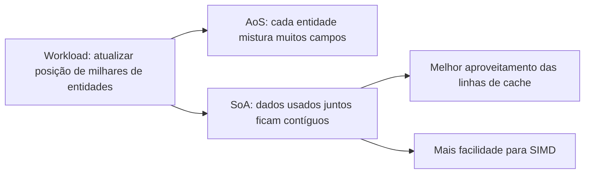

O Data-Oriented Design não significa "nunca use classes". Significa organizar os dados a partir do padrão real de acesso do programa.

### Uma correção importante sobre tamanho e alinhamento

Não é correto afirmar que uma estrutura de 56 bytes "cabe perfeitamente em uma cache line" em qualquer situação. Uma estrutura de 56 bytes pode atravessar duas cache lines dependendo do endereço inicial e da sequência de objetos.

O que interessa é a combinação entre:

- tamanho;
- alinhamento;
- padding;
- endereço inicial;
- padrão de acesso;
- quantidade de dados realmente utilizados pelo algoritmo.

### Mensagem da aula

> A CPU não sabe que você criou uma classe `Sprite`. Ela enxerga bytes e acessos a endereços.

---

# Aula 3 — Desenhando na força bruta
## Framebuffer, blitting e software rendering

Uma forma poderosa de tornar a hierarquia de memória concreta é implementar uma pequena renderização inteiramente em software.

Uma tela 1920×1080 com 4 bytes por pixel exige:

```text
1920 × 1080 × 4
= 8.294.400 bytes
≈ 7,9 MiB
```

Um framebuffer pode ser imaginado como um vetor linear:

```c
uint32_t framebuffer[1920 * 1080];
```

### Mapeando coordenadas para memória

Para pixels armazenados linearmente:

```text
index = y * largura + x
```

Ou, em bytes:

```text
endereço = base + y * stride + x * bytes_por_pixel
```

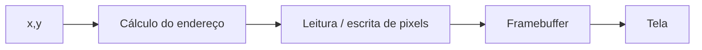

## Blitting

Em um blit simples, o software copia um bloco de pixels de uma região de memória para outra, respeitando clipping, stride, transparência e demais regras necessárias.

```text
Sprite na memória
┌───────────────┐
│ ░ ░ █ █ █ ░   │
│ ░ █ █ █ █ █   │
│ ░ ░ █ █ █ ░   │
└───────────────┘
          │
          │ copiar / compor
          ▼
Framebuffer
┌──────────────────────────────┐
│                              │
│        ░ ░ █ █ █ ░           │
│        ░ █ █ █ █ █           │
│        ░ ░ █ █ █ ░           │
│                              │
└──────────────────────────────┘
```

A grande descoberta dessa aula é:

> **renderização pode ser entendida como um problema de transformação e movimentação de grandes quantidades de dados.**

## Fixed-point: uma perspectiva histórica

Antes de unidades de ponto flutuante extremamente eficientes, fixed-point era uma técnica importante para executar cálculos fracionários usando inteiros.

Exemplo conceitual em formato 8.8:

```text
inteiro armazenado:  256
valor representado:  1,0
```

Uma divisão por 256 poderia ser realizada com deslocamento de bits em determinados contextos.

O ponto pedagógico não deve ser "inteiro é sempre mais rápido". Em hardware moderno, ponto flutuante pode ter excelente throughput. A escolha depende do hardware, da precisão necessária, do compilador e do algoritmo.

---

# Aula 4 — Quando escalar significa paralelizar
## SIMD, throughput e GPU

À medida que o número de pixels, partículas, vértices e entidades cresce, uma única sequência de execução pode se tornar insuficiente. A solução não é apenas tentar executar cada instrução mais rapidamente. É executar **muitos elementos em paralelo**.

## Primeiro: paralelismo dentro da CPU

Antes da GPU, CPUs modernas já exploram SIMD.

```text
Escalar:
A0 + B0
A1 + B1
A2 + B2
A3 + B3

SIMD:
┌────┬────┬────┬────┐
│ A0 │ A1 │ A2 │ A3 │
└────┴────┴────┴────┘
          +
┌────┬────┬────┬────┐
│ B0 │ B1 │ B2 │ B3 │
└────┴────┴────┴────┘
          │
          ▼
┌────┬────┬────┬────┐
│ C0 │ C1 │ C2 │ C3 │
└────┴────┴────┴────┘
```

Isso prepara o conceito de GPU.

## CPU versus GPU

A diferença fundamental não deve ser resumida a "CPU tem poucos núcleos e GPU tem milhares". A ideia mais útil é:

| CPU | GPU |
|---|---|
| Otimizada para baixa latência e execução geral | Otimizada para alto throughput e paralelismo de dados |
| Controle de fluxo complexo | Muitos elementos executados de forma semelhante |
| Branches e decisões diversas | Workloads regulares e altamente paralelos |
| Grandes mecanismos de cache e especulação | Grande capacidade agregada de processamento paralelo |

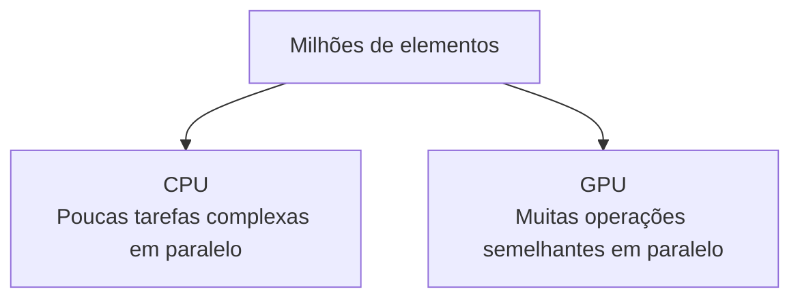

---

# Aula 5 — O preço de separar CPU e GPU
## RAM, VRAM e PCI Express

Em uma arquitetura discreta tradicional, CPU e GPU podem possuir pools de memória diferentes.

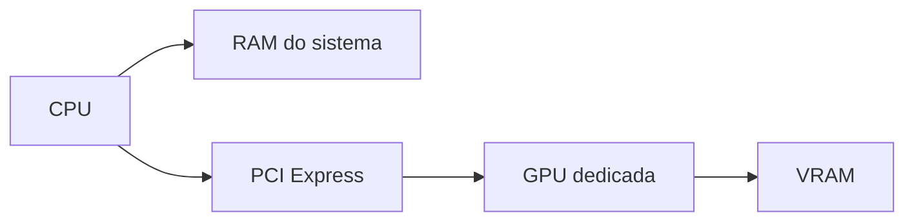

Quando um recurso precisa passar de um domínio para outro, existe uma questão de movimentação de dados.

Por exemplo:

```text
SSD
 ↓
RAM
 ↓
PCIe
 ↓
VRAM
 ↓
GPU
```

O PCIe não deve ser apresentado simplesmente como "um gargalo sempre presente". O custo depende da quantidade de dados, frequência das transferências, largura do link, sincronização e do comportamento do workload.

A ideia central é:

> **quando CPU e GPU possuem memórias separadas, a movimentação entre esses domínios torna-se parte explícita do problema de desempenho.**

---

# Aula 6 — A quebra do modelo: Apple Silicon e memória unificada
## SoC e Unified Memory Architecture

No Apple Silicon, CPU, GPU e outros aceleradores são integrados em um SoC e podem compartilhar um espaço de memória unificado.

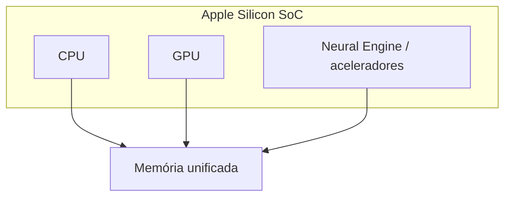

Isso elimina a necessidade arquitetural de manter uma VRAM separada para a GPU integrada ao SoC.

### O que muda?

Em vez de pensar:

```text
RAM → cópia → VRAM → GPU
```

podemos pensar em:

```text
Memória unificada
       │
   ┌───┼────┐
   ▼   ▼    ▼
  CPU GPU  outros aceleradores
```

O benefício fundamental é a redução da necessidade de cópias explícitas entre pools físicos separados.

### O que não desaparece?

UMA não transforma acesso à memória em algo "grátis". Continuam existindo:

- latência;
- largura de banda;
- pressão sobre o subsistema de memória;
- sincronização;
- coerência de caches;
- contenção entre CPU e GPU;
- custo de movimentação interna de dados.

Portanto, **zero-copy não significa zero-cost**.

### A nova pergunta

No modelo discreto:

> Como movemos os dados entre CPU e GPU?

No modelo unificado:

> Como compartilhamos a memória sem criar contenção desnecessária?

Essa mudança de pergunta é uma das ideias mais importantes do curso.

---

# Aula 7 — Programando para o silício
## Data layout, branching, dispatch e abstrações

Agora o aluno possui o modelo mental necessário para olhar para o próprio código de outra maneira.

A otimização deixa de ser uma coleção de "truques" e passa a seguir uma lógica:

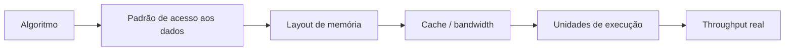

## Polimorfismo dinâmico e virtual dispatch

Em uma hierarquia orientada a objetos, uma chamada virtual pode envolver um acesso indireto através de uma vtable:

```text
Objeto
  │
  ▼
vptr
  │
  ▼
vtable
  │
  ▼
endereço do método
  │
  ▼
indirect call
```

Isso **não significa que toda chamada virtual causará cache miss**. O impacto depende do contexto, do compilador, do branch predictor, do layout dos objetos e da possibilidade de inlining.

O ponto importante é que o dispatch dinâmico pode dificultar otimizações e reduzir previsibilidade em workloads muito sensíveis a throughput.

## Tagged Union

Uma alternativa em certos designs é representar explicitamente variantes de dados:

```zig
const Sprite = union(enum) {
    single: SingleSprite,
    multi: MultiSprite,
};
```

A execução pode então ser organizada como:

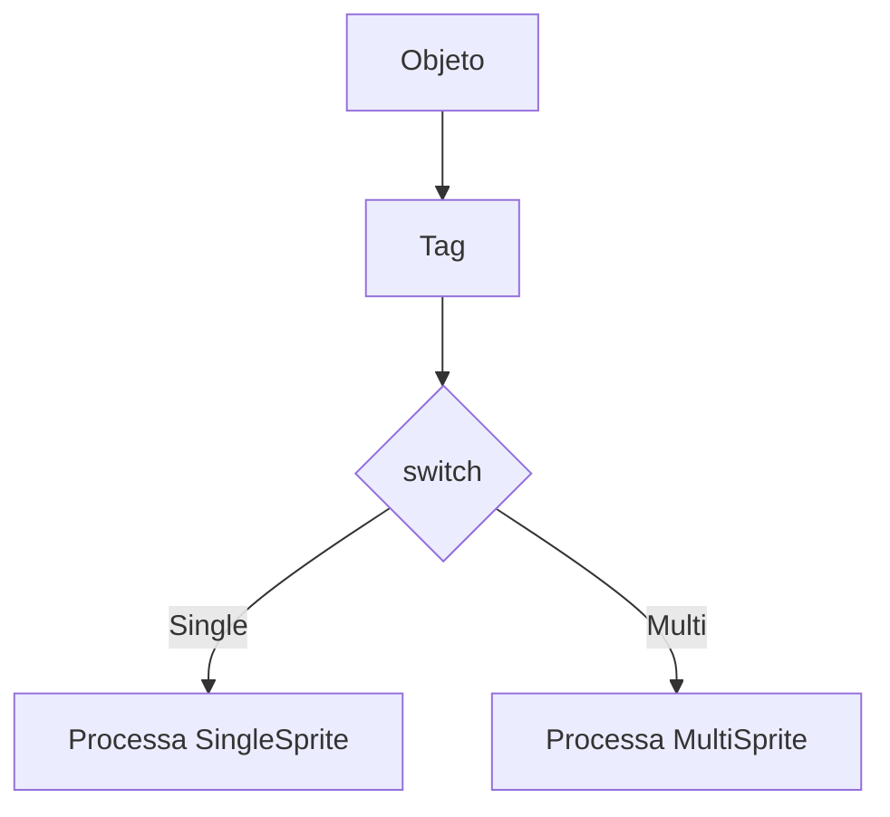

A vantagem não é "switch sempre é mais rápido que vtable". A vantagem é que o layout e as possibilidades de execução ficam mais explícitos para o compilador e para o programador, o que pode favorecer especialização, inlining e melhor organização dos dados.

---

# Aula 8 — A verdadeira sinfonia de performance
## CPU, dados, memória e GPU trabalhando juntos

O curso termina voltando à pergunta inicial:

> **Onde está o dado, quem precisa dele e quanto custa levá-lo até lá?**

Uma visão final do pipeline:

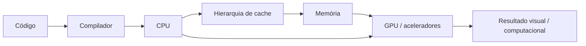

O programador de alto desempenho não tenta controlar cada transistor. Ele procura alinhar:

```text
algoritmo
   ↓
estrutura de dados
   ↓
localidade
   ↓
paralelismo
   ↓
movimentação de dados
   ↓
hardware
```

### A ideia final

> **Performance não é apenas fazer a CPU calcular mais rápido. É fazer com que os dados certos cheguem às unidades de execução certas, na hora certa, com o menor desperdício possível.**

---

# Mapa completo do curso

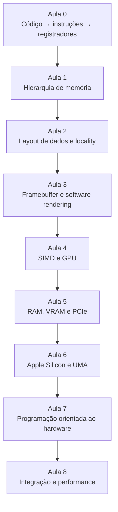

## Progressão pedagógica

```text
Aula 0  → ENTENDER A MÁQUINA
Aula 1  → ENTENDER A MEMÓRIA
Aula 2  → ENTENDER OS DADOS
Aula 3  → OBSERVAR OS DADOS EM AÇÃO
Aula 4  → ENTENDER O PARALELISMO
Aula 5  → ENTENDER A TRANSFERÊNCIA
Aula 6  → REINTERPRETAR A ARQUITETURA
Aula 7  → PROGRAMAR CONSIDERANDO O HARDWARE
Aula 8  → INTEGRAR TUDO
```

---

# Exercício transversal sugerido

Para manter as aulas conectadas, um mesmo pequeno projeto pode evoluir ao longo do curso:

```text
Aula 0 → vetor simples
Aula 1 → medir efeitos de cache
Aula 2 → AoS versus SoA
Aula 3 → framebuffer + sprites
Aula 4 → SIMD / paralelismo
Aula 5 → upload para GPU
Aula 6 → experimento CPU/GPU em memória unificada
Aula 7 → virtual dispatch versus tagged union
Aula 8 → benchmark e análise de performance
```

Isso transforma o curso de uma sequência de conceitos em uma única investigação contínua:

> **"O que acontece com meu programa quando eu mudo a forma como os dados são organizados e processados?"**
